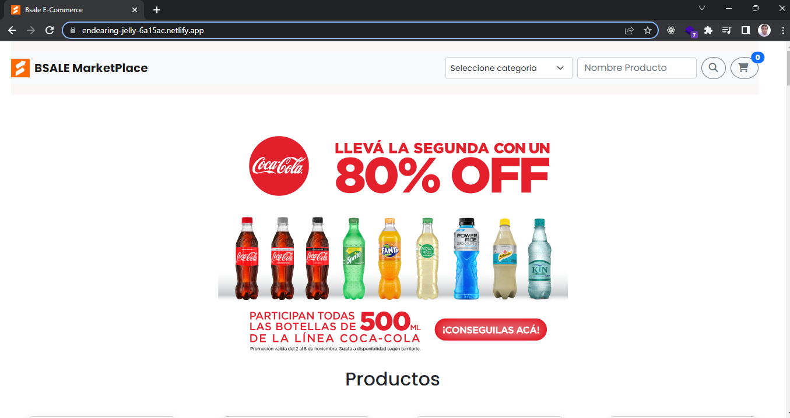
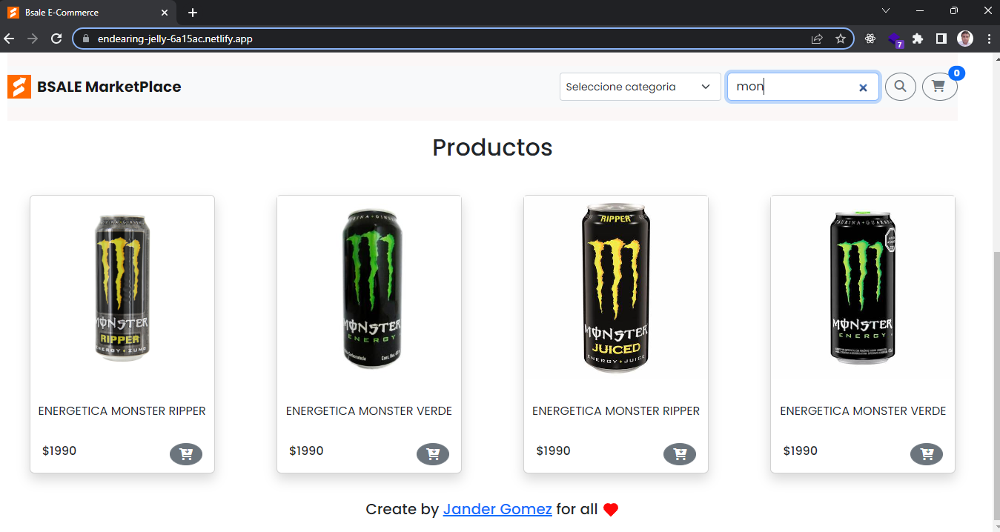
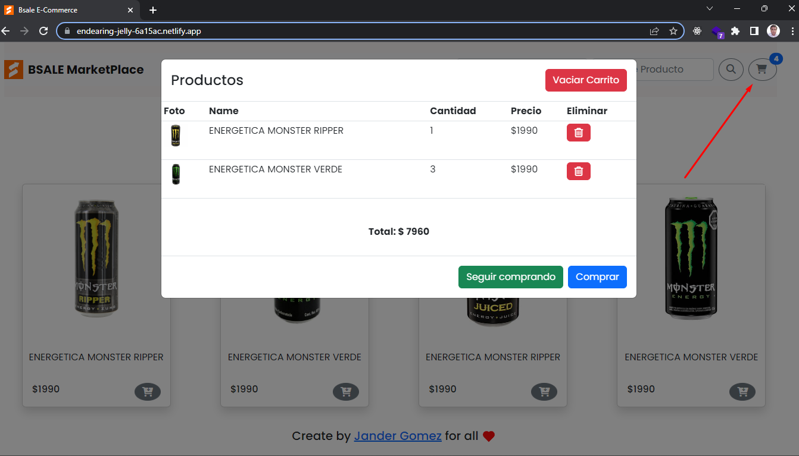

 <h1 align="center">🚀 E-Commerce Bsale 🚀</h1>

<h2 align="center">📃 Información General 📃</h2>

Proyecto correspondiente a challenge de conocimiento por la empresa Bsale 🚀

El proyecto consiste en una tienda online, con las siguientes funciones

<ul>
  <li>Filtrar los productos por Categorias.</li>
  <li>Hacer una busqueda consumiendo una API creada desde el Back-End.</li>
  <li>La busqueda es dinámica, va encontrando las coincidencias según las letras ingresadas, si no encuentra el producto muestra un mensaje.</li>
  <li>Se implento un carrito de compras. Tiene la funcionalidad de agregar productos y quitarlos del mismo</li>
  <li>Se utilizó para persistencia de datos del carrito, con la propiedad localStorage de windows</li>
  <li>La tienda online esta implementada como una SPA(Single Page Aplication)</li>
  <li>Tiene diseño responsive</b>
</ul>

<h2> Tecnologías utilizadas 💻 </h2>
<ul>
  <li>JavaScript Vanilla</li>
  <li>Bootstrap</li>
  <li>Node.js</li>
</ul>

<h2> Instalación y comandos 🔧</h2>
<ul>
  <li> git clone https://github.com/Jander1016/e-commerce-front-bsale </li>
  <li> cd /cli </li>
  <li> npm install </li>
</ul>

<h2> 🚀 Deploy BSale MarketPlace 🚀 </h2>

La aplicación esta disponible en la web, con el siguiente link

Link Deploy https://endearing-jelly-6a15ac.netlify.app/

<h2> Documentación Aplicación📃</h2>

Documentación de la Apliacación: https://beamish-fairy-8a464b.netlify.app/

Documentación de la API del Back-End: https://e-commerce-back-bsale-production.up.railway.app/api/v1/docs/

<h2> Imagenes 💻</h2>

  

  

  

